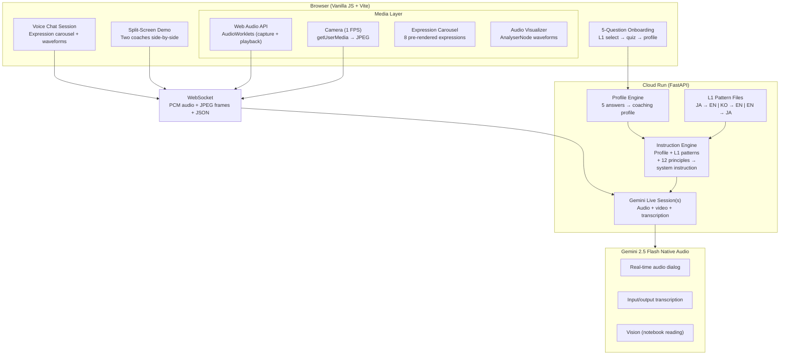

# LoLA — Loka Learning Avatar

Adaptive language coaching that adapts to **how your brain learns** — not just what you say.

Built on the [Gemini Multimodal Live API](https://ai.google.dev/gemini-api/docs/live) with native audio, real-time vision, and a 12-principle neurolinguistic coaching framework. Two learners can make the same mistake and receive visibly different coaching based on their psychological profile.

> Hackathon entry for the [Gemini Live Agent Challenge](https://googledevelopers.devpost.com/) (Live Agents category). Forked from Google's [Immergo](https://github.com/ZackAkil/immersive-language-learning-with-live-api) language learning demo (Apache 2.0).

**[Live Demo](https://lola-bivpadh7zq-uc.a.run.app)** | [Architecture Diagram](docs/lola-architecture.png) | [Blog Post](docs/BLOG_POST.md)

---

## The Innovation

Most AI tutors give every learner the same correction. LoLA generates a **unique coaching personality** from a 30-second onboarding quiz, then adjusts in real time:

| Same error: *"I go to the restaurant yesterday"* | |
|---|---|
| **The Analyst** (Profile A) | Pauses. "Good structure. 'Yesterday' is a time marker — what tense does that need? 昨日...行った — same idea." Waits for the learner to self-correct. |
| **The Explorer** (Profile B) | "You went to a restaurant! What did you eat? ナイス！" Recasts the error naturally, keeps momentum flowing. |

The split-screen demo runs both sessions simultaneously — same mic input, two coaches, two different responses.

---

## Architecture



### Audio Pipeline

```
Browser mic → capture.worklet.js → PCM 16kHz → WebSocket → FastAPI → Gemini
Gemini audio → WebSocket → playback.worklet.js → gainNode → speakers
                                                      ↓
                                                 AnalyserNode → waveform visualizer
                                                      ↓
                                            Output transcription → expression detection → carousel
```

### Split-Screen Pipeline

```
Single mic → capture worklet → PCM → ┬→ WebSocket A → Gemini (Analyst, voice: Kore)
                                      └→ WebSocket B → Gemini (Explorer, voice: Aoede)

AudioPlayer A ←─ WS A          AudioPlayer B ←─ WS B
     │                              │
     └── click panel to switch ─────┘  (one audible at a time, both show waveforms + transcripts)
```

---

## Quick Start (Local Dev)

### Prerequisites

- Node.js 18+
- Python 3.10+
- A [Gemini API key](https://aistudio.google.com/apikey)

### Setup

```bash
git clone https://github.com/ORBWEVA/lola.git
cd lola

# Install frontend dependencies
npm install

# Set up Python virtualenv
python3 -m venv venv
source venv/bin/activate
pip install -r requirements.txt

# Configure environment
cp .env.example .env
# Edit .env and add your GEMINI_API_KEY
```

### Run

```bash
./scripts/dev.sh
# That's it — open http://localhost:5173
```

Three commands to a running app: `git clone` → `cp .env.example .env` (add your key) → `./scripts/dev.sh`. Backend runs on port 8000 (Vite proxies `/api` and `/ws`).

---

## Cloud Run Deployment

### One-command deploy

```bash
# 1. Authenticate and set project
gcloud auth login
gcloud config set project your-gcp-project-id  # Replace with your GCP project ID

# 2. Store API key in Secret Manager (once)
echo -n "YOUR_GEMINI_API_KEY" | gcloud secrets create GEMINI_API_KEY --data-file=-

# 3. Deploy
./scripts/deploy.sh
```

### Automated CI/CD (Cloud Build)

```bash
gcloud builds submit --config cloudbuild.yaml
```

Or wire `cloudbuild.yaml` to a GitHub push trigger for continuous deployment.

**Demo day tip:** Avoid cold starts with `MIN_INSTANCES=1 ./scripts/deploy.sh`

---

## Project Structure

```
lola/
├── server/                     # FastAPI backend (Python)
│   ├── main.py                 # App entry — REST, WebSocket, static serving
│   ├── gemini_live.py          # Gemini Live API session manager
│   ├── profile_engine.py       # 5-question onboarding → coaching profile
│   ├── instruction_engine.py   # Profile + L1 + 12 principles → system instruction
│   ├── principles.py           # 12-principle coaching framework (weighted)
│   └── l1_patterns/            # L1 interference patterns
│       ├── japanese.py         # JA→EN patterns + L1 bridges
│       ├── korean.py           # KO→EN patterns + L1 bridges
│       └── english.py          # EN→JA patterns + L1 bridges
├── src/                        # Frontend (Vanilla JS Web Components)
│   ├── components/
│   │   ├── view-lola.js        # Main session — onboarding + voice chat
│   │   ├── split-screen.js     # Dual-session demo view
│   │   ├── expression-carousel.js  # Avatar expression image crossfade
│   │   ├── audio-visualizer.js # Guitar-string waveform via AnalyserNode
│   │   └── live-transcript.js  # Real-time transcript bubbles
│   └── lib/gemini-live/        # Gemini Live API client + media utilities
├── public/
│   ├── avatars/                # Pre-rendered expression images (FLUX Kontext)
│   └── audio-processors/       # AudioWorklet processors (capture + playback)
├── scripts/
│   ├── dev.sh                  # Start local dev environment
│   ├── deploy.sh               # Cloud Run deploy script
│   └── generate-expressions.js # Avatar image generation pipeline
├── Dockerfile                  # Multi-stage build (Node + Python)
├── cloudbuild.yaml             # Cloud Build CI/CD pipeline
└── docs/                       # Specs, master doc, addenda
```

---

## Tech Stack

| Layer | Technology |
|-------|-----------|
| LLM | Gemini 2.5 Flash Native Audio (`gemini-2.5-flash-native-audio-preview-12-2025`) |
| Backend | Python 3.10 / FastAPI / `google-genai` SDK |
| Frontend | Vanilla JS / Vite / Web Components / Web Audio API |
| Avatar | Pre-rendered FLUX Kontext Pro expressions (8 per profile) |
| Deployment | Google Cloud Run |
| Avatar generation | FLUX Schnell Free (anchors) + FLUX Kontext Pro (expressions) via Together AI |

---

## The 12-Principle Framework

LoLA's coaching is grounded in neurolinguistic research, not prompt engineering intuition:

| # | Principle | Source |
|---|-----------|--------|
| 1 | Growth Mindset Activation | Dweck (2006) |
| 2 | Rapport & Anchoring | Paling (2017) |
| 3 | Emotional State Management | Immordino-Yang (2016) |
| 4 | Cognitive Load Management | Sweller (2011) |
| 5 | Spacing & Interleaving | Roediger & Butler (2011) |
| 6 | Retrieval Practice | Roediger & Butler (2011) |
| 7 | Sensory Engagement | Paling (2017) |
| 8 | Positive Framing | Fredrickson (2001) |
| 9 | Autonomy & Choice | Deci & Ryan (1985) |
| 10 | Progressive Challenge | Vygotsky (1978) |
| 11 | VAK Adaptation | Fleming (2001) |
| 12 | Meta-Model Questioning | Bandler & Grinder (1975) |

Each principle carries a weight (0.0–1.0) determined by the learner's profile. The instruction engine composes these into a unique system prompt per session.

---

## Supported Languages

| Direction | L1 | Target | Profiles |
|-----------|-----|--------|----------|
| JA → EN | Japanese | English | Profile A (Analyst), Profile B (Explorer) |
| KO → EN | Korean | English | Custom via onboarding |
| EN → JA | English | Japanese | Profile C (Analyst), Profile D (Explorer) |

---

## Environment Variables

| Variable | Required | Default | Description |
|----------|----------|---------|-------------|
| `GEMINI_API_KEY` | Yes (local) | — | Google AI Studio API key |
| `PROJECT_ID` | Yes (Vertex) | — | GCP project (alternative to API key) |
| `DEV_MODE` | No | `true` | Skips reCAPTCHA + lenient rate limits |
| `SESSION_TIME_LIMIT` | No | `180` | Max session length in seconds |
| `RECAPTCHA_SITE_KEY` | No | — | reCAPTCHA v3 for bot protection |
| `REDIS_URL` | No | — | Redis for distributed rate limiting |

---

## License

Apache 2.0 — see [LICENSE](LICENSE).

Built by [ORBWEVA](https://orbweva.com) for the Gemini Live Agent Challenge hackathon.
