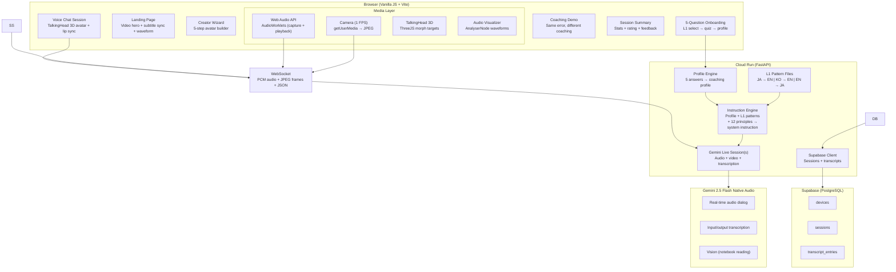

# LoLA — Loka Learning Avatar

Adaptive language coaching that adapts to **how your brain learns** — not just what you say.

Built on the [Gemini Multimodal Live API](https://ai.google.dev/gemini-api/docs/live) with native audio, real-time vision, and a 12-principle neurolinguistic coaching framework. Two learners can make the same mistake and receive visibly different coaching based on their psychological profile.

> Hackathon entry for the [Gemini Live Agent Challenge](https://googledevelopers.devpost.com/) (Live Agents category). Forked from Google's [Immergo](https://github.com/ZackAkil/immersive-language-learning-with-live-api) language learning demo (Apache 2.0).

**[Live Demo](https://lola-640563380978.us-central1.run.app)** | [Architecture Diagram](docs/lola-architecture.png) | [Blog Post](docs/BLOG_POST.md)

---

## The Innovation

Most AI tutors give every learner the same correction. LoLA generates a **unique coaching personality** from a 30-second onboarding quiz, then adjusts in real time:

| Same error: *"I go to the restaurant yesterday"* | |
|---|---|
| **The Analyst** (Profile A) | Pauses. "Good structure. 'Yesterday' is a time marker — what tense does that need? 昨日...行った — same idea." Waits for the learner to self-correct. |
| **The Explorer** (Profile B) | "You went to a restaurant! What did you eat? ナイス！" Recasts the error naturally, keeps momentum flowing. |

The split-screen demo runs both sessions simultaneously — same mic input, two coaches, two different responses.

---

## Features

- **Video landing page** with word-by-word subtitle sync, canvas waveform, and browser-language detection (8 languages)
- **3D TalkingHead avatar** with real-time lip sync from Gemini audio output
- **Vision input** — point your camera at a menu, sign, or notebook and LoLA coaches from what it sees
- **Creator wizard** — build a custom coaching avatar in 5 steps (name, domain, personality, appearance, voice)
- **"Same Error, Different Coaching" demo** — side-by-side proof that LoLA adapts to the learner, not just the mistake
- **Post-session summary** with stats, 3-point rating, and optional text feedback
- **12-principle coaching engine** generating unique system instructions per learner profile
- **L1 interference patterns** for Japanese, Korean, and English learners
- **Natural barge-in** via Gemini native audio — interrupt LoLA mid-sentence naturally

---

## Architecture



### Audio Pipeline

```
Browser mic → capture.worklet.js → PCM 16kHz → WebSocket → FastAPI → Gemini
Gemini audio → WebSocket → playback.worklet.js → gainNode → speakers
                                                      ↓
                                                 AnalyserNode → waveform visualizer
                                                      ↓
                                            Output transcription → expression detection → carousel
```

### Split-Screen Pipeline

```
Single mic → capture worklet → PCM → ┬→ WebSocket A → Gemini (Analyst, voice: Kore)
                                      └→ WebSocket B → Gemini (Explorer, voice: Aoede)

AudioPlayer A ←─ WS A          AudioPlayer B ←─ WS B
     │                              │
     └── click panel to switch ─────┘  (one audible at a time, both show waveforms + transcripts)
```

---

## Quick Start (Local Dev)

### Prerequisites

- Node.js 18+
- Python 3.10+
- A [Gemini API key](https://aistudio.google.com/apikey)

### Setup

```bash
git clone https://github.com/ORBWEVA/lola.git
cd lola

# Install frontend dependencies
npm install

# Set up Python virtualenv
python3 -m venv venv
source venv/bin/activate
pip install -r requirements.txt

# Configure environment
cp .env.example .env
# Edit .env and add your GEMINI_API_KEY
```

### Run

```bash
./scripts/dev.sh
# That's it — open http://localhost:5173
```

Three commands to a running app: `git clone` → `cp .env.example .env` (add your key) → `./scripts/dev.sh`. Backend runs on port 8000 (Vite proxies `/api` and `/ws`).

---

## Cloud Run Deployment

### One-command deploy

```bash
# 1. Authenticate and set project
gcloud auth login
gcloud config set project your-gcp-project-id  # Replace with your GCP project ID

# 2. Store API key in Secret Manager (once)
echo -n "YOUR_GEMINI_API_KEY" | gcloud secrets create GEMINI_API_KEY --data-file=-

# 3. Deploy
./scripts/deploy.sh
```

### Automated CI/CD (Cloud Build)

```bash
gcloud builds submit --config cloudbuild.yaml
```

Or wire `cloudbuild.yaml` to a GitHub push trigger for continuous deployment.

**Demo day tip:** Avoid cold starts with `MIN_INSTANCES=1 ./scripts/deploy.sh`

### Automated Deployment (IaC)

LoLA uses Infrastructure as Code for automated cloud deployment:

| File | Purpose |
|------|---------|
| `cloudbuild.yaml` | CI/CD pipeline — build, push to Artifact Registry, deploy to Cloud Run |
| `Dockerfile` | Multi-stage build (Node.js frontend → Python backend) |
| `scripts/deploy.sh` | One-command manual deploy via `gcloud run deploy` |

**Set up a GitHub push trigger for continuous deployment:**

```bash
gcloud builds triggers create github \
  --repo-name=lola \
  --repo-owner=ORBWEVA \
  --branch-pattern="^main$" \
  --build-config=cloudbuild.yaml \
  --description="Deploy LoLA on push to main"
```

Every push to `main` triggers Cloud Build → container build → Cloud Run deploy. No manual steps after initial setup.

---

## Project Structure

```
lola/
├── server/                     # FastAPI backend (Python)
│   ├── main.py                 # App entry — REST, WebSocket, static serving
│   ├── gemini_live.py          # Gemini Live API session manager
│   ├── profile_engine.py       # 5-question onboarding → coaching profile
│   ├── instruction_engine.py   # Profile + L1 + 12 principles → system instruction
│   ├── principles.py           # 12-principle coaching framework (weighted)
│   ├── db.py                   # Supabase client (sessions, transcripts, credits)
│   └── l1_patterns/            # L1 interference patterns
│       ├── japanese.py         # JA→EN patterns + L1 bridges
│       ├── korean.py           # KO→EN patterns + L1 bridges
│       └── english.py          # EN→JA patterns + L1 bridges
├── src/                        # Frontend (Vanilla JS Web Components)
│   ├── components/
│   │   ├── app-root.js         # SPA router — view switching + state management
│   │   ├── view-landing.js     # Landing page — video hero + subtitles + waveform
│   │   ├── view-lola.js        # Main session — onboarding + voice chat + TalkingHead
│   │   ├── view-creator.js     # 5-step avatar creation wizard
│   │   ├── view-demo.js        # "Same Error, Different Coaching" comparison
│   │   ├── view-session-summary.js  # Post-session stats + rating + feedback
│   │   ├── view-dashboard.js   # User dashboard — sessions, transcripts, credits
│   │   ├── split-screen.js     # Dual-session demo view
│   │   └── live-transcript.js  # Real-time transcript bubbles
│   └── lib/
│       ├── gemini-live/        # Gemini Live API client + media utilities
│       ├── subtitle-sync.js    # Video subtitle sync engine (rAF + word timing)
│       └── waveform.js         # Canvas 48-bar waveform renderer
├── public/
│   ├── hero-combined.mp4       # Landing page hero video (avatar intros)
│   ├── hero-combined-subtitles.json  # Per-word subtitle timing data
│   └── audio-processors/       # AudioWorklet processors (capture + playback)
├── scripts/
│   ├── dev.sh                  # Start local dev environment
│   ├── deploy.sh               # Cloud Run deploy script
│   └── generate-expressions.js # Avatar image generation pipeline
├── supabase/
│   └── migrations/             # PostgreSQL schema files
├── Dockerfile                  # Multi-stage build (Node + Python)
├── cloudbuild.yaml             # Cloud Build CI/CD pipeline
└── docs/                       # Specs, master doc, addenda
```

---

## Tech Stack

| Layer | Technology |
|-------|-----------|
| LLM | Gemini 2.5 Flash Native Audio (`gemini-2.5-flash-native-audio-preview-12-2025`) |
| Backend | Python 3.10 / FastAPI / `google-genai` SDK |
| Frontend | Vanilla JS / Vite / Web Components / Web Audio API |
| Avatar | TalkingHead v1.7 (`@met4citizen/talkinghead`) + ThreeJS — 3D lip-synced avatar |
| Persistence | Supabase (PostgreSQL — sessions, transcripts, credits) |
| Deployment | Google Cloud Run |

---

## The 12-Principle Framework

LoLA's coaching is grounded in neurolinguistic research, not prompt engineering intuition:

| # | Principle | Source |
|---|-----------|--------|
| 1 | Growth Mindset Activation | Dweck (2006) |
| 2 | Rapport & Anchoring | Paling (2017) |
| 3 | Emotional State Management | Immordino-Yang (2016) |
| 4 | Cognitive Load Management | Sweller (2011) |
| 5 | Spacing & Interleaving | Roediger & Butler (2011) |
| 6 | Retrieval Practice | Roediger & Butler (2011) |
| 7 | Sensory Engagement | Paling (2017) |
| 8 | Positive Framing | Fredrickson (2001) |
| 9 | Autonomy & Choice | Deci & Ryan (1985) |
| 10 | Progressive Challenge | Vygotsky (1978) |
| 11 | VAK Adaptation | Fleming (2001) |
| 12 | Meta-Model Questioning | Bandler & Grinder (1975) |

Each principle carries a weight (0.0–1.0) determined by the learner's profile. The instruction engine composes these into a unique system prompt per session.

---

## Supported Languages

| Direction | L1 | Target | Profiles |
|-----------|-----|--------|----------|
| JA → EN | Japanese | English | Profile A (Analyst), Profile B (Explorer) |
| KO → EN | Korean | English | Custom via onboarding |
| EN → JA | English | Japanese | Profile C (Analyst), Profile D (Explorer) |

---

## Environment Variables

| Variable | Required | Default | Description |
|----------|----------|---------|-------------|
| `GEMINI_API_KEY` | Yes (local) | — | Google AI Studio API key |
| `PROJECT_ID` | Yes (Vertex) | — | GCP project (alternative to API key) |
| `DEV_MODE` | No | `true` | Skips reCAPTCHA + lenient rate limits |
| `SESSION_TIME_LIMIT` | No | `180` | Max session length in seconds |
| `RECAPTCHA_SITE_KEY` | No | — | reCAPTCHA v3 for bot protection |
| `REDIS_URL` | No | — | Redis for distributed rate limiting |
| `SUPABASE_URL` | No | — | Supabase project URL (enables persistence) |
| `SUPABASE_SERVICE_KEY` | No | — | Supabase service role key |

---

## Cloud Run Secrets

When deploying to Cloud Run, Supabase credentials are stored in Google Secret Manager alongside the Gemini API key:

```bash
echo -n "YOUR_SUPABASE_URL" | gcloud secrets create SUPABASE_URL --data-file=-
echo -n "YOUR_SUPABASE_KEY" | gcloud secrets create SUPABASE_SERVICE_KEY --data-file=-
```

These are automatically mounted by `deploy.sh` and `cloudbuild.yaml`.

---

## Third-Party Disclosure

This project is built on a fork of Google's Immergo language learning demo (open-source, Apache 2.0 license, listed as an official hackathon resource) by Zack Akil. The 3D avatar rendering uses the TalkingHead library (MIT license) by Mika Suominen (met4citizen) with the HeadAudio module for real-time lip-sync. Avatar models are created via Ready Player Me. The adaptive coaching engine, personality profiling system, 12-principle coaching framework, multilingual L1 interference patterns, bilingual coaching logic, vision-aware coaching rules, avatar mood mapping, split-screen demonstration view, and all system instruction generation logic are original work created during the contest period.

---

## License

Apache 2.0 — see [LICENSE](LICENSE).

Built by [ORBWEVA](https://orbweva.com) for the Gemini Live Agent Challenge hackathon.
