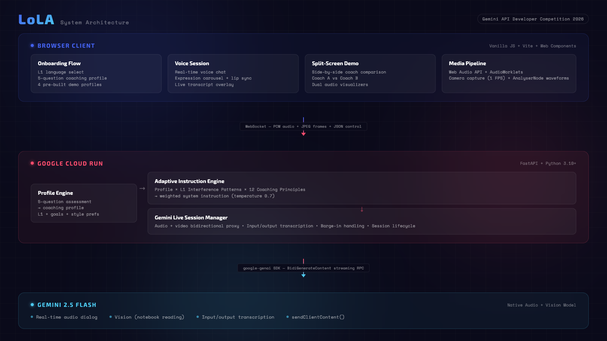

# Building Adaptive Language Coaching with Gemini Live API

*How 12 neurolinguistic principles, a 30-second personality quiz, and Gemini's native audio turn a one-size-fits-all tutor into a coach that actually adapts.*

---

Two panels on screen. Same learner. Same microphone. Same mistake: "I go to the restaurant yesterday."

On the left, The Analyst pauses. She references the Japanese past tense concept -- how 昨日 (yesterday) signals 〜した in Japanese, so "yesterday" should trigger past tense in English too. She asks the learner to self-correct, giving them space to reason through it.

On the right, The Explorer laughs. "You went to a restaurant! What did you eat? ナイス！" She recasts the error naturally, embedding the correct form inside a question that keeps the conversation flowing. No grammar lecture. No pause. Just momentum.

Same mistake. Two completely different coaching responses. Two different Gemini Live API sessions running simultaneously, each guided by a different personality profile composed from the same 12 principles -- just weighted differently.

That is LoLA.

<!-- When publishing to Medium/dev.to, replace with hosted image URL -->

*Same mic input, two Gemini sessions, two visibly different coaching responses.*

---

## The Problem Nobody Talks About

Japan ranks #87 on the EF English Proficiency Index. Korea sits at #49. These are countries that spend billions annually on English education. The average Japanese student studies English for six years in school. Korean parents spend more per capita on private English tutoring than almost any country on earth.

The issue is not practice volume. It is not access to materials. It is not motivation.

The issue is that every AI language tutor treats every learner the same.

A shy, analytical learner who needs to understand grammar rules before they will open their mouth gets the same correction style as an outgoing explorer who learns by throwing themselves into conversation and picking up patterns through immersion. The analytical learner shuts down when pushed to "just speak." The explorer gets bored when forced to drill conjugation tables.

That is tutoring. Tutoring delivers content. Coaching adapts to the human.

Most AI language products are tutors wearing a coaching hat. They have one correction style, one pacing model, one emotional register. They might adjust difficulty, but they never adjust *how* they teach. LoLA -- Loka Learning Avatar -- was built to close that gap.

<!-- When publishing to Medium/dev.to, replace with hosted image URL -->


## A 30-Second Onboarding That Changes Everything

When a learner opens LoLA, the first thing they see is not a textbook or a lesson plan. It is five questions, asked in their native language.

For a Japanese speaker learning English:

> 英語を間違えた時、最初にどう感じますか？ (When you make an English mistake, what is your first reaction?)
>
> - a) なぜ間違えたのか理解したい (I want to understand WHY I made it)
> - b) ちょっと恥ずかしい... (A little embarrassed...)
> - c) 気にしない、続けたい (I don't care, I want to keep going)

Five questions. Thirty seconds. The answers map to five psychological dimensions:

1. **Error response style** -- analytical, emotional safety, or challenge-forward
2. **Learning preference** -- structure-first, experience-first, or social-contextual
3. **Motivation driver** -- metrics, emotion, or real-world application
4. **Pacing** -- reflective or action-oriented
5. **Instruction depth** -- depth-first, flow-first, or bridge-building

The `profile_engine.py` maps answers to dimensions:

```python
ANSWER_MAP = {
    "q1": {"a": "analytical", "b": "emotional_safety", "c": "challenge_forward"},
    "q2": {"a": "structure_first", "b": "experience_first", "c": "social_contextual"},
    "q3": {"a": "metrics", "b": "emotion", "c": "application"},
    "q4": {"a": "reflective", "b": "action"},
    "q5": {"a": "depth_first", "b": "flow_first", "c": "bridge_building"},
}
```

Simple. Deterministic. No LLM call required for profiling. The profile is a plain Python dictionary -- portable, inspectable, and reproducible.

<!-- When publishing to Medium/dev.to, replace with hosted image URL -->

*Five personality questions in the learner's native language generate a unique coaching profile.*

## 12 Principles, Weighted Per Learner

Here is where it gets interesting. LoLA's coaching framework is built on 12 peer-reviewed neurolinguistic principles:

1. **Growth Mindset Activation** (Dweck 2006) -- frame corrections as progress, not deficit
2. **Rapport & Anchoring** (Paling 2017) -- establish trust before correction
3. **Emotional State Management** (Immordino-Yang 2016) -- normalize struggle, celebrate incrementally
4. **Cognitive Load Management** (Sweller 2011) -- one concept at a time
5. **Spacing & Interleaving** -- return to previous corrections later in conversation
6. **Retrieval Practice** -- design outputs that require active recall
7. **Sensory Engagement** -- create vivid scenarios across modalities
8. **Positive Framing** -- lead with what is right before addressing what to fix
9. **Autonomy & Choice** -- let learners choose topics and pace
10. **Progressive Challenge** -- stay in the zone of proximal development
11. **VAK Adaptation** -- rotate visual, auditory, and kinesthetic channels
12. **Meta-Model Questioning** -- challenge limiting beliefs about language ability

Each principle has weight adjustments per coaching dimension. An analytical learner who prefers structure-first learning gets high weights on Cognitive Load Management (0.9), Retrieval Practice (0.9), and Meta-Model Questioning (0.9). An explorer who prefers experience-first gets high weights on Sensory Engagement (0.9), Autonomy & Choice (0.9), and Positive Framing (1.0).

The `get_weighted_principles()` function scores all 12 principles against the learner's profile and returns the top 6, ranked by relevance:

```python
def get_weighted_principles(profile: dict, top_n: int = 6) -> list:
    scored = []
    for p in PRINCIPLES:
        total_weight = 0.0
        count = 0
        for dim_key, dim_values in p["weights"].items():
            profile_value = profile.get(dim_key)
            if profile_value and profile_value in dim_values:
                total_weight += dim_values[profile_value]
                count += 1
        avg_weight = total_weight / max(count, 1)
        scored.append({
            "id": p["id"],
            "name": p["name"],
            "description": p["description"],
            "weight": round(avg_weight, 2),
        })
    scored.sort(key=lambda x: x["weight"], reverse=True)
    return scored[:top_n]
```

No fine-tuning. No RAG. Just structured data composed into a system prompt that Gemini follows with remarkable consistency.

## L1 Interference: The Patterns Your Teacher Never Knew

Generic AI tutors correct errors generically. LoLA knows *why* you are making the error based on your first language.

Japanese speakers learning English face specific, documented interference patterns:

- **Missing articles** -- Japanese has no equivalent to "a" or "the"
- **Tense errors** -- Japanese uses 〜した for past tense, not verb conjugation
- **Pronoun dropping** -- Japanese is pro-drop ("Is delicious" instead of "It is delicious")
- **Plural omission** -- "many friend" (Japanese has no obligatory plural marking)
- **L/R distinction** -- phonological merger of /r/ and /l/
- **Word order** -- SOV in Japanese vs SVO in English

These are not guesses. They are well-documented in second language acquisition research, and they are encoded as structured data in `l1_patterns/japanese.py`, `korean.py`, and `english.py` (for English speakers learning Japanese).

When the instruction engine composes the final system prompt, it includes these patterns explicitly:

```
L1-SPECIFIC INTERFERENCE PATTERNS (correct these when you hear them):
- Missing articles (a/the) — Japanese has no equivalent
- Tense errors — Japanese uses 〜した for past, not verb conjugation
- Pronoun dropping — Japanese is pro-drop
...
```

The result: when a Japanese speaker says "I go to restaurant yesterday," LoLA does not just hear a generic grammar error. It recognizes three concurrent interference patterns -- missing article, missing past tense, missing article again -- and the coaching style determines which one to address, how to address it, and whether to bridge the explanation through Japanese.

## The Gemini Live API: Why This Was Not Possible Before

LoLA depends on three capabilities that are unique to the Gemini Live API.

### Native Audio Processing

Gemini 2.5 Flash Native Audio processes and generates speech directly. No speech-to-text. No text-to-speech. The model hears intonation, hesitation, confidence, and frustration in the raw audio stream. This matters enormously for coaching -- a learner who says "I go to the restaurant yesterday" with a confident upswing needs a different response than one who trails off uncertainly.

The audio pipeline runs through AudioWorklets for real-time PCM streaming:

```
Browser mic -> capture.worklet.js -> PCM 16kHz -> WebSocket -> FastAPI -> Gemini Live API
Gemini audio -> WebSocket -> playback.worklet.js -> speakers + AnalyserNode -> visualization
```

The capture worklet buffers audio at 4096 samples before sending, balancing latency against network efficiency:

```javascript
class AudioCaptureProcessor extends AudioWorkletProcessor {
  constructor() {
    super();
    this.bufferSize = 4096;
    this.buffer = new Float32Array(this.bufferSize);
    this.bufferIndex = 0;
  }

  process(inputs) {
    const inputChannel = inputs[0]?.[0];
    if (!inputChannel) return true;

    for (let i = 0; i < inputChannel.length; i++) {
      this.buffer[this.bufferIndex++] = inputChannel[i];
      if (this.bufferIndex >= this.bufferSize) {
        this.port.postMessage({ type: "audio", data: this.buffer.slice() });
        this.bufferIndex = 0;
      }
    }
    return true;
  }
}
```

### Mid-Session Context Injection

This is the feature that makes the split-screen demo possible and unlocks personality switching entirely.

Gemini's `sendClientContent()` allows you to inject new context into a running voice session without disconnecting. No other voice API supports this. With OpenAI's Realtime API, changing the system prompt means tearing down the session and starting fresh. With Gemini, you can push a profile switch mid-conversation:

```python
def generate_context_update(context_type: str, details: str = "") -> str:
    if context_type == "vision":
        return f"[CONTEXT UPDATE: The learner is showing you something through their camera. {details}]"
    elif context_type == "frustration":
        return "[CONTEXT UPDATE: The learner sounds frustrated. Increase emotional scaffolding.]"
    elif context_type == "topic_shift":
        return f"[CONTEXT UPDATE: {details}]"
```

In the split-screen demo, both panels start sessions simultaneously. A profile switch on one panel injects a new system instruction via `sendClientContent()`, and the coaching personality shifts audibly within the same conversation. The learner does not have to reconnect or restart. The session is continuous.

### Vision Input

Gemini Live accepts image frames alongside audio. LoLA sends 1fps JPEG frames from the learner's camera. The coach can see handwritten notebooks, restaurant menus, textbook pages, or presentation slides and weave them into the coaching conversation naturally.

A learner holds up a handwritten English essay. LoLA reads it, identifies errors that match their L1 interference patterns, and coaches them through corrections using their preferred style -- all in real time, all through voice.

## Standing on Immergo's Shoulders

LoLA is forked from Google's Immergo, the official language learning demo for the Gemini Live API built by Zack Akil. Immergo deserves credit for solving the hard infrastructure problems: WebSocket setup, audio streaming architecture, camera input framework, and the basic FastAPI-to-Gemini proxy pattern.

What LoLA adds on top:

- **Adaptive coaching engine**: `profile_engine.py`, `instruction_engine.py`, `principles.py` -- the entire profile-to-system-prompt pipeline
- **L1 interference patterns**: three language files with documented linguistic interference data
- **5-question onboarding**: presented in the learner's native language
- **Split-screen demo**: two simultaneous Gemini sessions showing different coaching personalities
- **Expression carousel**: AI-generated avatar expressions using FLUX Schnell and Kontext Pro (Together AI)
- **Cloud Run deployment**: multi-stage Dockerfile, automated CI/CD

The Immergo fork is a good example of how open-source base projects (Apache 2.0) let you focus on your actual innovation rather than rebuilding plumbing.

## Lessons Learned the Hard Way

Building with bleeding-edge APIs means discovering things that are not in the documentation. Here are the hard-won debugging stories from building LoLA.

### The TalkingHead Morph Target Mystery

I spent five attempts trying to get a 3D avatar's mouth to sync with Gemini's audio output. I was using the TalkingHead library, setting viseme values correctly, and... nothing. The mouth would not move.

After hours of debugging, I traced it to line 1591 of `talkinghead.mjs`:

```javascript
if (!o.needsUpdate) continue;
```

You have to set BOTH the value AND a boolean flag:

```javascript
mt["viseme_aa"].newvalue = 0.5;
mt["viseme_aa"].needsUpdate = true;  // Without this, the update is silently skipped
```

Without `needsUpdate = true`, the library skips the update entirely. No error. No warning. Just silence. I ultimately pivoted to an expression crossfade approach with waveform visualization, which turned out to be a better UX anyway -- but those five failed attempts taught me to always read the rendering loop, not just the API surface.

### Gemini's Undocumented Limitations

The Gemini Live API has configuration options called `enable_affective_dialog` and `proactivity`. They sound useful for a coaching application. They are in the documentation. They silently fail on native audio models.

No error is thrown. No warning logged. The session starts, and the model just behaves unpredictably. I lost a full day to this before discovering through trial and error that these features simply are not supported on the `gemini-2.5-flash-native-audio-preview` model. The fix was a comment in the codebase and a hard rule: do not include unsupported fields in the setup config.

### Temperature Is a Coaching Personality Knob

The default temperature of 1.0 causes Gemini to ignore system instructions roughly 30% of the time. For a chatbot, that is a minor annoyance. For a coaching personality that needs to feel consistent -- always analytical, always warm, always high-energy -- it is a dealbreaker.

Dropping to 0.7 gave consistent instruction following. The Analyst stayed analytical. The Explorer stayed energetic. The coaching personality became reliable enough that learners could develop trust in their coach's consistency.

### AudioWorklet Is Powerful but Painful

Real-time PCM streaming at 16kHz through AudioWorklets requires careful attention to buffer sizes, sample rate matching, and worklet processor lifecycle management. The worklet runs on a separate thread with no access to the DOM or most browser APIs. Debugging is limited to `console.log` in a context where the console itself is not always visible.

Get the buffer size wrong and you get clicks and pops. Get the sample rate wrong and the audio sounds like a chipmunk or a whale. Get the lifecycle wrong and the worklet dies silently mid-session. Each of these happened. Each was resolved through patience and careful logging.

<!-- When publishing to Medium/dev.to, replace with hosted image URL -->

*Browser → Cloud Run → Gemini 2.5 Flash Native Audio*

## Architecture: One Command to Deploy

LoLA runs on Google Cloud Run with a multi-stage Docker build:

```dockerfile
# Stage 1: Build the Frontend
FROM node:22-alpine AS frontend-builder
WORKDIR /app
COPY package*.json ./
RUN npm ci --ignore-scripts
COPY public ./public
COPY src ./src
COPY index.html vite.config.js ./
RUN npm run build

# Stage 2: Set up the Backend
FROM python:3.10-slim
WORKDIR /app
COPY requirements.txt .
RUN pip install --no-cache-dir -r requirements.txt
COPY --from=frontend-builder /app/dist ./dist
COPY server ./server
CMD ["python", "-m", "server.main"]
```

Node.js builds the Vite frontend. Python serves everything -- REST endpoints via FastAPI, WebSocket upgrade for Gemini Live sessions, and static file serving from the built `dist/` directory. One container. One command: `./scripts/deploy.sh`.

The FastAPI backend handles authentication (reCAPTCHA validation), rate limiting (Redis-backed in production, in-memory for development), and session management with one-time-use tokens that expire after 30 seconds.

## What Comes Next

LoLA is a hackathon build, but the adaptive coaching engine is the foundation for something larger.

**Educator Creator Platform.** Any educator -- a pronunciation coach in Tokyo, a business English teacher in Seoul, a dialect trainer in Osaka -- builds and monetizes their own coaching avatar. They define their coaching philosophy. The platform generates the weighted principle set. Their avatar teaches their way, at scale, 24/7.

**Self-marketing flywheel.** AI coaching avatars that generate their own social media content, build their own audience, and attract learners autonomously. The coach is not just a product -- it is a brand.

**Domain-agnostic expansion.** The adaptive coaching engine is not language-specific. Restaurant service training. Medical communication. Sports coaching. Any domain where the "how you teach" matters as much as the "what you teach" can benefit from a system that adapts its coaching personality to the individual learner.

**Co-active learning triangle.** The long-term vision is a three-way relationship: Educator defines the coaching philosophy. AI scales the coaching methodology. Learner receives personalized instruction. The educator stays in control. The AI does the heavy lifting. The learner gets a coach, not a tutor.

## Closing

LoLA was built solo over a long weekend in Adelaide, Australia. It is not polished. The avatar expressions are a creative workaround for a lip sync system that fought me for five iterations. The split-screen demo sometimes stutters when both Gemini sessions are streaming audio simultaneously. The onboarding quiz could use a sixth question about preferred correction frequency.

But the core idea -- that a 30-second personality quiz, 12 weighted principles, and language-specific interference patterns can compose a system instruction that makes Gemini behave like a genuinely adaptive coach -- works. You can hear it in the split-screen demo. Same mistake. Two different coaches. Two different humans would learn better from different ones.

That is coaching. That is what LoLA does.

I created this piece of content for the purposes of entering the Gemini Live Agent Challenge hackathon.

Try the live demo: [https://lola-bivpadh7zq-uc.a.run.app](https://lola-bivpadh7zq-uc.a.run.app)

Built by Ryan Ahamer ([ORBWEVA](https://orbweva.com)) with Gemini 2.5 Flash Native Audio, FastAPI, and a lot of AudioWorklet debugging.

`#GeminiLiveAgentChallenge`
